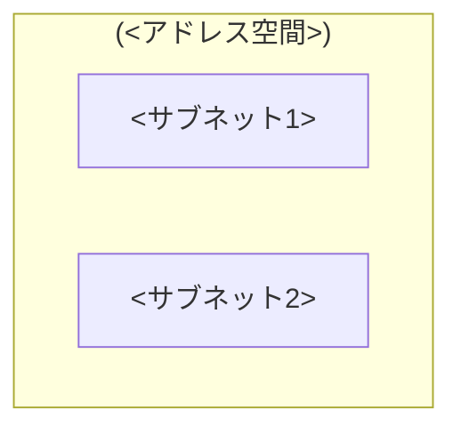

# Azure 構成スキャン

AZ CLI を使ってリソースグループの構成を調査し、ネットワーク構成・リソース一覧・外部公開状況を Markdown にまとめる。

## 使用法

```
/azure-config-scan <RG名>
/azure-config-scan <RG名> --resource <主要リソース名>
/azure-config-scan <RG名> --out <出力パス>
```

- `<RG名>`: 必須。調査対象のリソースグループ名
- `--resource`: 任意。主要リソース名を指定すると、そのリソースを中心に詳細調査する
- `--out`: 任意。出力先パス（デフォルト: `Resources/tech/ベネッセセキュリティ基準/<RG>-構成スキャン.md`）

---

## 絶対ルール（安全制約）

> **このスキルは完全な読み取り専用である。Azure環境に対する一切の変更を行ってはならない。**

### 許可されるコマンド（ホワイトリスト）

`az` コマンドのうち、以下のサブコマンドのみ実行を許可する:

- `show`
- `list`
- `get`

### 禁止されるコマンド

以下のサブコマンドは**いかなる理由でも実行してはならない**:

`create` / `update` / `delete` / `start` / `stop` / `restart` / `swap` / `set` / `add` / `remove` / `invoke` / `run-command` / `execute`

これらを含むコマンドを生成・実行した場合、本番環境に影響する可能性がある。

### その他のルール

| ルール | 理由 |
|--------|------|
| `az` コマンドには必ず `--output json` を付ける | パース可能性の担保 |
| `--query` JMESPath で必要なフィールドのみ取得する | 大量出力の回避 |
| 権限エラーは「未調査（権限不足）」として記録し、スキル全体を中断しない | 部分的な結果でも価値がある |
| Cross-RG リソース（Private DNS Zone 等）は必要に応じてサブスクリプション全体で検索する | RG を跨ぐリソースの漏れ防止 |

---

## 実行フェーズ

### Phase 1: 事前確認

1. `az account show --output json` で認証状態を確認する
   - 失敗した場合: ユーザーに `az login` を案内して終了
2. `az group show --name <RG> --output json` で RG の存在を確認する
   - 失敗した場合: RG 名の確認を依頼して終了
3. `date` で調査日時を取得する

### Phase 2: リソース全量取得

```bash
az resource list -g <RG> --query "[].{name:name, type:type, location:location, kind:kind}" --output json
```

結果を以下のカテゴリに分類する:

| カテゴリ | resource type (部分一致) |
|---------|------------------------|
| Compute | `Microsoft.Web/sites`, `Microsoft.Compute/virtualMachines`, `Microsoft.ContainerInstance`, `Microsoft.App/containerApps` |
| Network | `Microsoft.Network/virtualNetworks`, `Microsoft.Network/networkSecurityGroups`, `Microsoft.Network/publicIPAddresses`, `Microsoft.Network/privateEndpoints`, `Microsoft.Network/privateDnsZones`, `Microsoft.Network/loadBalancers`, `Microsoft.Network/applicationGateways` |
| Data | `Microsoft.DocumentDB`, `Microsoft.Sql`, `Microsoft.Storage`, `Microsoft.Cache/Redis`, `Microsoft.DBforPostgreSQL`, `Microsoft.DBforMySQL` |
| AI | `Microsoft.CognitiveServices`, `Microsoft.MachineLearningServices` |
| Security | `Microsoft.KeyVault`, `Microsoft.ManagedIdentity` |
| Other | 上記に該当しないもの |

### Phase 3: ネットワーク構成調査

以下のコマンドを**並列で**実行する:

```bash
# VNet 一覧
az network vnet list -g <RG> --output json

# NSG 一覧
az network nsg list -g <RG> --output json

# Public IP 一覧
az network public-ip list -g <RG> --output json

# Private Endpoint 一覧
az network private-endpoint list -g <RG> --output json

# Private DNS Zone 一覧
az network private-dns zone list -g <RG> --output json
```

**次に、結果に基づいて深掘りする:**

各 VNet に対して:
```bash
az network vnet subnet list --resource-group <RG> --vnet-name <VNET> --output json
```

各 NSG に対して:
```bash
az network nsg rule list --resource-group <RG> --nsg-name <NSG> --include-default --output json
```

各 Private DNS Zone に対して:
```bash
az network private-dns link vnet list --resource-group <RG> --zone-name <ZONE> --output json
```

**分析観点:**

1. **VNet/Subnet 構成**: アドレス空間、サブネットの用途分類、Service Endpoint の有無 → Mermaid 図を生成
2. **NSG 受信ルール**: カスタムルールを一覧化。`sourceAddressPrefix` が `*` または `Internet` のルールは**警告マーク付き**で記載
3. **Public IP**: 紐づくリソース（`ipConfiguration.id` から逆引き）を対応表にまとめる
4. **Private Endpoint**: 接続先リソース、プライベート IP、所属サブネット、対応する Private DNS Zone の対応表を作成
5. **Private DNS Zone の VNet リンク**: リンクされている VNet 一覧。VNet が存在するのにリンクされていない Zone があれば指摘

### Phase 4: PaaS 個別調査

Phase 2 のリソース一覧から、以下のタイプが存在する場合のみ該当コマンドを実行する。存在しないタイプはスキップする。

| resource type | コマンド | 確認する主要フィールド |
|---|---|---|
| `Microsoft.Web/sites` | `az webapp show -g <RG> -n <NAME> -o json` | httpsOnly, ftpsState, minTlsVersion, vnetName, publicNetworkAccess |
| 同上 | `az webapp config show -g <RG> -n <NAME> -o json` | linuxFxVersion, alwaysOn, numberOfWorkers |
| 同上 | `az webapp config access-restriction list -g <RG> -n <NAME> -o json` | IP 制限ルール |
| `Microsoft.CognitiveServices/accounts` | `az cognitiveservices account show -g <RG> -n <NAME> -o json` | properties.networkAcls, properties.publicNetworkAccess |
| `Microsoft.DocumentDB/databaseAccounts` | `az cosmosdb show -g <RG> -n <NAME> -o json` | publicNetworkAccess, isVirtualNetworkFilterEnabled, virtualNetworkRules, ipRules |
| `Microsoft.Storage/storageAccounts` | `az storage account show -g <RG> -n <NAME> -o json` | networkRuleSet.defaultAction, publicNetworkAccess, allowBlobPublicAccess |
| `Microsoft.KeyVault/vaults` | `az keyvault show -g <RG> -n <NAME> -o json` | properties.networkAcls, properties.publicNetworkAccess |
| `Microsoft.Sql/servers` | `az sql server show -g <RG> -n <NAME> -o json` | publicNetworkAccess, minimalTlsVersion |
| 同上 | `az sql server firewall-rule list -g <RG> -s <NAME> -o json` | ファイアウォールルール一覧 |
| `Microsoft.Cache/Redis` | `az redis show -g <RG> -n <NAME> -o json` | publicNetworkAccess, minimumTlsVersion |
| `Microsoft.Compute/virtualMachines` | `az vm show -g <RG> -n <NAME> -o json` | networkProfile, osProfile.linuxConfiguration / windowsConfiguration |
| `Microsoft.DBforPostgreSQL/flexibleServers` | `az postgres flexible-server show -g <RG> -n <NAME> -o json` | network, publicNetworkAccess |

**`--resource` オプションが指定されている場合:**
指定されたリソースについて、上記に加えて以下の深掘り調査を行う:
- Deployment Slot（App Service の場合）: `az webapp deployment slot list`
- Managed Identity: `az webapp identity show`
- 関連する Key Vault 参照の有無

### Phase 5: レポート生成

以下のテンプレートに基づいて Markdown ファイルを生成する。
リソースが存在しないセクションは省略する。

````markdown
---
title: <RG> 構成スキャン
created: YYYY-MM-DDTHH:mm:ss+09:00
updated: YYYY-MM-DDTHH:mm:ss+09:00
author: collaborative
tags: [azure, infrastructure]
status: active
---

# <RG> 構成スキャン

調査日: YYYY-MM-DD
サブスクリプション: <name> (<id>)
リージョン: <location>

## 1. リソース一覧

### Compute
| 名前 | タイプ | 種類 | リージョン |
|------|--------|------|----------|

### Network
| 名前 | タイプ | リージョン |
|------|--------|----------|

### Data
（同様のテーブル）

### AI
（同様のテーブル）

### Security
（同様のテーブル）

### Other
（同様のテーブル）

## 2. ネットワーク構成

### 2.1. VNet / サブネット



| VNet | サブネット | CIDR | NSG | Service Endpoints | 委任 |
|------|----------|------|-----|-------------------|------|

### 2.2. NSG 受信ルール

**<NSG名>:**

| 優先度 | 名前 | ソース | 宛先 | ポート | プロトコル | アクション | 備考 |
|--------|------|--------|------|--------|-----------|-----------|------|

> source が `*` または `Internet` で Allow の場合は `[!]` マーク付きで記載

### 2.3. パブリック IP

| 名前 | IP アドレス | 割当方式 | 紐づくリソース |
|------|-----------|---------|--------------|

### 2.4. Private Endpoint / DNS Zone

| PE 名 | 接続先リソース | サブネット | プライベート IP |
|--------|-------------|----------|--------------|

| DNS Zone | VNet リンク | 状態 |
|----------|-----------|------|

## 3. リソース別構成

### 3.1. App Service

| 項目 | 値 |
|------|-----|
| ランタイム | |
| HTTPS Only | |
| Min TLS | |
| FTPS State | |
| VNET 統合 | |
| Always On | |
| インスタンス数 | |
| Public Network Access | |
| IP 制限 | （ルール数と概要） |

### 3.2. データベース

（Cosmos DB / SQL DB / PostgreSQL 等、存在するもののみ）

| 項目 | 値 |
|------|-----|
| publicNetworkAccess | |
| defaultAction / VNet フィルタ | |
| IP ルール | |
| Private Endpoint | |

### 3.3. ストレージ

| アカウント名 | defaultAction | publicNetworkAccess | allowBlobPublicAccess |
|------------|---------------|---------------------|----------------------|

### 3.4. Key Vault

| 項目 | 値 |
|------|-----|
| publicNetworkAccess | |
| defaultAction | |
| Private Endpoint | |

### 3.5. AI / Cognitive Services

| リソース名 | 種類 | publicNetworkAccess | defaultAction |
|-----------|------|---------------------|---------------|

### 3.6. VM

| VM 名 | OS | サイズ | Public IP | NSG |
|--------|-----|--------|-----------|-----|

## 4. 外部公開状況サマリ

| リソース | タイプ | publicNetworkAccess | defaultAction | Public IP | 備考 |
|---------|--------|---------------------|---------------|-----------|------|

## 5. 所見

（調査結果から気になる点を箇条書き。例:）
- NSG で source: * の Inbound Allow が存在する
- Key Vault に Private Endpoint がない
- Private DNS Zone が VNet にリンクされていない
````

---

## エラーハンドリング

| エラー | 対処 |
|--------|------|
| `az account show` 失敗 | 「`az login` を実行してください」と案内して終了 |
| `az group show` 失敗 | RG 名の確認を依頼して終了 |
| 個別リソースで権限エラー (`AuthorizationFailed`) | 該当リソースを「未調査（権限不足）」として記録し、次のリソースに進む |
| `az` コマンドのタイムアウト | 再試行 1 回。それでも失敗なら「未調査（タイムアウト）」として記録 |
| リソースが別 RG に存在 (Private DNS Zone 等) | サブスクリプション全体で検索: `az network private-dns zone list --output json`（`-g` なし） |
| `--query` で想定外の JSON 構造 | `--query` を外して生の JSON を取得し、構造を確認してから再実行 |
