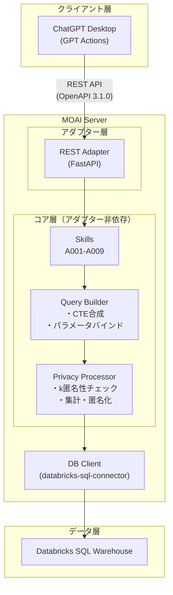
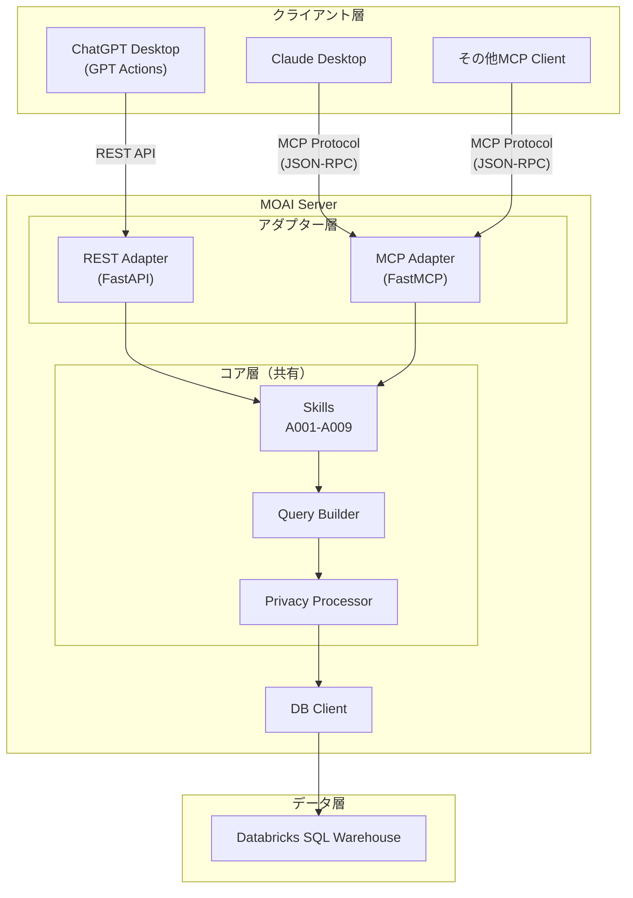
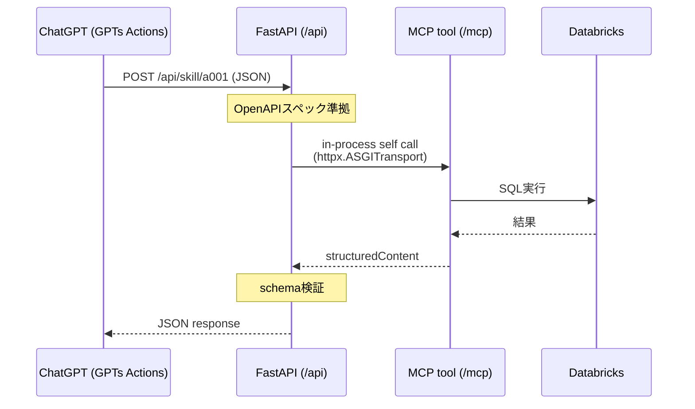
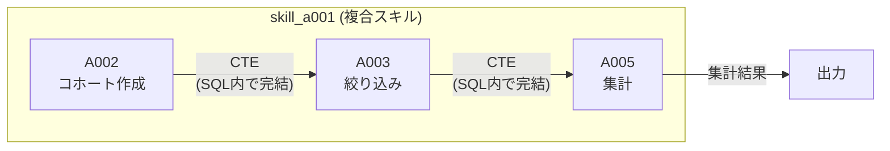
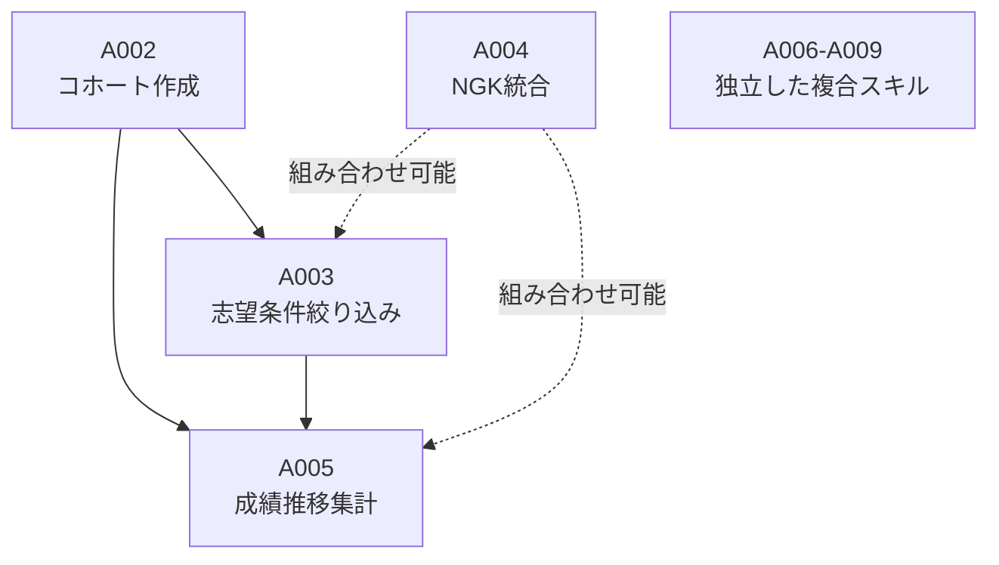
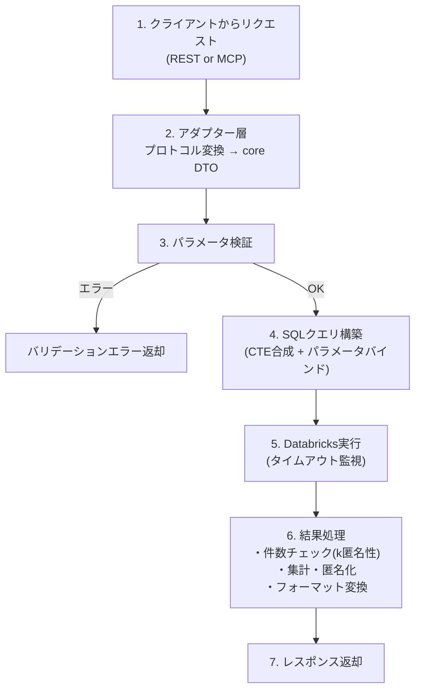
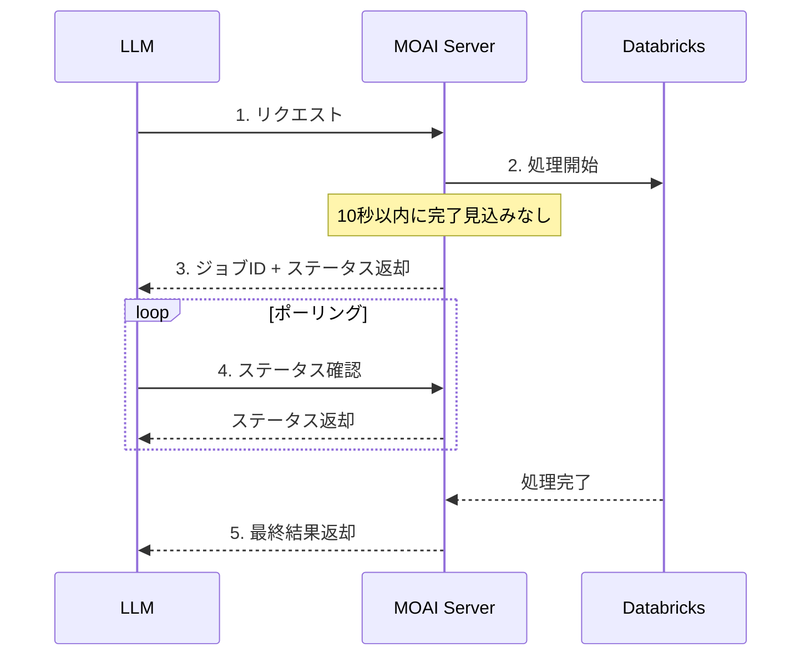
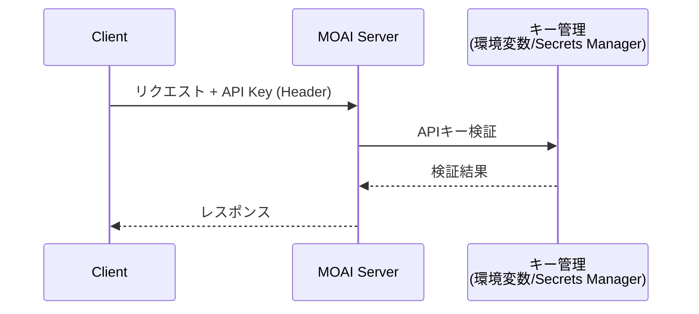
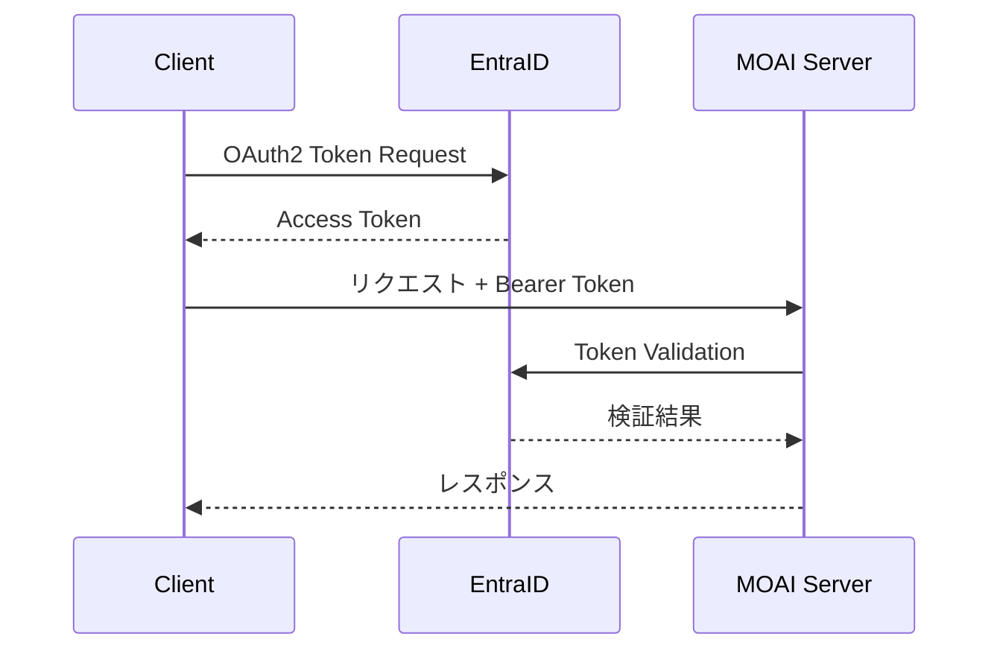

OpenAI Codex v0.80.0 (research preview)
--------
workdir: /Users/asaiyasutaka/repo/asai-work-vault-v2/Projects/moai/repos/moai_pj_api
model: gpt-5.3-codex
provider: openai
approval: never
sandbox: read-only
reasoning effort: medium
reasoning summaries: auto
session id: 019c5041-e61f-71e1-96b8-bf650053e6ed
--------
user
# Role
あなたはCodex。非対話モードで動作し、提案のみを行う。実際の適用は人間が行う。

# Goal
design-draft.md v0.4 のレビュー。3つの観点: (1) セクション1.3(スキャフォルド実装構成)が既存セクション(1.1/1.2, 5.1, 9)と矛盾する箇所の整理 (2) セクション4.1のパスがハイフン区切りだが実装ではスネークケースに統一する方針での設計書更新方法 (3) A001 First実装時に不足・曖昧な情報の指摘

# Constraints
- read-only前提（変更は提案のみ）
- 変更範囲: /Users/asaiyasutaka/repo/asai-work-vault-v2/Projects/moai/docs/design-draft.md
- スタイル: 既存のlint/formatに従う
- 日本語で回答。設計書のレビューのみ（コード変更提案不要）。具体的な修正案をセクション単位で提示。

# Forbidden
- 秘密情報（鍵・個人情報・社外秘URL・顧客データ）の出力禁止
- 実行時の副作用を持つコードの実行禁止

# Context

## 対象ファイル

### /Users/asaiyasutaka/repo/asai-work-vault-v2/Projects/moai/docs/design-draft.md
```
# MOAI MCPサーバー 設計書（たたき）

| 項目 | 内容 |
|---|---|
| 文書バージョン | 0.3 |
| 作成日 | 2026-02-02 |
| ステータス | ドラフト（たたき） |

---

## 0. GPTs互換性検証フェーズ（実装前に実施）

### 背景・目的

API設計（入出力形式、エンドポイント粒度）を確定する前に、**GPTsが実際にリクエストを正しく構築でき、レスポンスを正しく解釈できるか**を検証する。検証結果に応じてセクション4（API設計）を更新する。

### 検証対象

| # | 検証項目 | リスク | 影響範囲 |
|---|---|---|---|
| V1 | **入力: ネストされたオブジェクト** | `subjects: [{name: "英語", deviation_min: 63, ...}]`を正しく構築できるか | DTO設計、OpenAPI schema |
| V2 | **入力: 日本語の値** | `"2年"`, `"7月"`, `"英語"`などを正しく渡せるか | フィールド定義（日本語 vs コード値） |
| V3 | **出力: 大量の時系列データ** | 13回×5科目×4統計量のJSONを解釈・要約できるか | レスポンス設計 |
| V4 | **出力: 抑制時の応答** | `suppressed: true`時に適切にユーザーに伝えられるか | エラーハンドリング |
| V5 | **粒度: エンドポイント数** | 9エンドポイントで適切に選択できるか | エンドポイント構成 |

### 検証方法

1. A001相当のFastAPIスタブを作成（Databricks不要、ハードコードレスポンス）
2. GPT Actionsに登録し、自然言語プロンプトで検証
3. 入出力フォーマットを変えて複数パターン比較

### テストするレスポンス形式

**パターンA: フラットな時系列**
```json
{
  "cohort_count": 152,
  "time_series": [
    {"grade_exam": "1年7月", "subject": "英語", "mean": 55.3, "median": 54.0, "p25": 48.2, "p75": 61.5}
  ]
}
```

**パターンB: 科目別グルーピング**
```json
{
  "cohort_count": 152,
  "by_subject": {
    "英語": [{"grade_exam": "1年7月", "mean": 55.3, "median": 54.0}]
  }
}
```

**パターンC: テキスト要約付き**
```json
{
  "cohort_count": 152,
  "summary": "該当先輩152人の英語偏差値は1年7月の平均55.3から3年7月の63.2まで上昇傾向...",
  "data": { ... }
}
```

### 検証結果→設計変更の対応表

| 検証結果 | 設計変更 |
|---|---|
| ネスト入力を構築できない | フラットスキーマに変更（`subject1_name`, `subject1_min`...） |
| 日本語の値が不安定 | コード値に変更（`grade: "2"`, `month: "07"`）+ マッピングテーブル |
| 大量データの解釈が不正確 | サーバー側で要約テキスト付与（パターンC）or データ量制限 |
| 9エンドポイントで選択ミス頻発 | A001に集約 or 3-4エンドポイントに統合 |

---

## 1. システム構成図

### 1.1 Phase 1（PoC）: FastAPI + GPT Actions



### 1.2 Phase 2（将来）: FastMCP追加



**Adapterパターンのポイント**:
- core層はFastAPI/FastMCPに一切依存しない
- RESTアダプターとMCPアダプターは薄いラッパー（DTOの変換+ルーティングのみ）
- Phase 2でMCPアダプターを追加する際、core層の変更は不要

### 1.3 スキャフォルド実装構成（確定）

高梨スキャフォルド (`moai_pj_api`) は、design-draft v0.3のAdapter分離とは異なり、**MCPをコアとし、RESTはMCPへのself callで実現する構成**を採用している。

#### design-draft との差分

| 観点 | design-draft v0.3 | スキャフォルド（実装） |
|------|-------------------|----------------------|
| コア層 | `core/` (FastAPI/MCP非依存) | `mcp/tools/` + `mcp/lib/` がロジック本体 |
| REST (/api) | 独自adapter、coreを直接呼び出し | MCP toolへのin-process self call |
| MCP | Phase 2で追加 | Phase 1から同梱 |
| schema | `core/dto/` | `schema/` (MCP/REST共通) |
| DB接続 | `core/db/client.py` | `mcp/lib/databricks/` (SQLAlchemy QueuePool) |

#### ChatGPT → API 呼び出しフロー



#### 起動・設定

- `ENABLE_FAST_API=true` で REST (/api) を有効化
- `ENABLE_OAUTH=true` で OAuth (Entra) を有効化（本番）
- `ENABLE_OAUTH=false` はローカル検証のみ

#### 新しいスキル（A002-A009）をChatGPTに公開する手順

1. **schema定義**: `src/moai_pj_api/schema/` にPydantic request/response schema追加
2. **MCP tool実装**: `src/moai_pj_api/mcp/tools/` にtool追加、`mcp/registry.py` に登録
3. **REST公開**: `src/moai_pj_api/fast_api/lib/specs.py` の `REST_TOOL_SPECS` に追記
4. **OpenAPI生成**: `task dump-formatted-openapi-json` で `servers.url` をFQDNに差し替えたJSONを出力
5. **GPTs登録**: 出力されたOpenAPI JSONをChatGPT GPTs Actionsに設定

#### スキャフォルドのディレクトリ構成

```
src/moai_pj_api/
+- asgi.py                   # ASGI entrypoint (/mcp + /api mount)
+- __main__.py               # stdio entrypoint
+- schema/                   # Pydantic schema (MCP/REST共通の契約)
   +- common.py              # StrictBaseModel等
   +- databricks_diag.py     # 既存ツールの例
+- mcp/                      # MCP本体（ロジックはここに集約）
   +- registry.py            # tool登録の集約点
   +- tools/                 # 各tool実装 (register(mcp)パターン)
      +- server.py
      +- me.py
      +- databricks_diag.py  # 既存: DB接続toolの実装パターン
   +- lib/
      +- config.py           # DatabricksConfig (環境変数ベース)
      +- databricks/         # DB接続層 (pool, execute_query, errors)
      +- auth/               # OAuth/Authz
      +- middlewares/         # HTTP middleware
+- fast_api/                 # REST (/api)。MCP toolをself callで呼ぶ
   +- app.py                 # FastAPIアプリ生成
   +- lib/
      +- specs.py            # REST公開のallowlist（ここに1行追加するだけ）
      +- router.py           # ルーティング（GET query handler等）
      +- executor.py         # self call + schema検証
+- common/                   # MCP/FastAPI非依存のユーティリティ
+- const/                    # 定数
```

#### 依存ルール

- `schema/` と `common/` は共通の土台（MCP/FastAPI非依存）
- `mcp/` と `fast_api/` は相互依存しない
- `fast_api/` は `mcp/tools/` や `mcp/lib/` を直接importしない（self call経由）
- CTE Builderやスキルロジックは `mcp/lib/` に配置

---

## 2. スキルアーキテクチャ

### 2.1 複合スキル内完結方式

スキル間の一時データはサーバー内部で完結させ、外部に中間状態を返さない。



**実装方式**: 各スキルは`build_cte()`メソッドでSQL CTEフラグメントを返す。複合スキル(A001)はこれらを連結して**1本のSQL**としてDatabricksに送信する。中間のBENEID集合はDatabricks内に閉じ、サーバーメモリにもAPIレスポンスにも出ない。

### 2.2 コホート管理: ステートレス方式

コホート（先輩の集合）はサーバー側に保持しない。

- A002/A003を個別に呼び出す場合、A003のinputにA002の条件（学年・科目・偏差値帯）を含める
- A003は内部でA002のCTEを再構築し、1本のSQLとして実行
- Databricksのクエリキャッシュが同一条件の再実行を最適化

```python
# A003のinputにはA002の条件を含む
class A003Input(BaseModel):
    grade_exam: GradeExam        # A002と同じ条件
    subjects: list[SubjectCondition]  # A002と同じ条件
    admission: AdmissionFilter   # A003固有
```

**ステートレスにする理由**:
- GPT ActionsもMCPも本質的にステートレス
- サーバー側のセッション管理・キャッシュ（Redis等）が不要
- 水平スケール可能
- 会話途切れ時のキー失効問題がない

### 2.3 スキル依存関係



---

## 3. データフロー

### 3.1 基本フロー



### 3.2 長時間処理フロー



---

## 4. GPT Actions API設計（暫定、検証後に確定）

### 4.1 エンドポイント一覧（暫定）

| パス | operationId | 説明 |
|---|---|---|
| `POST /api/alumni/score-history` | `getAlumniScoreHistory` | 志望大合格先輩の成績推移（複合） |
| `POST /api/cohorts/ability-match` | `createAbilityMatchedCohort` | 同学力帯コホート作成 |
| `POST /api/cohorts/admission-filter` | `filterCohortByAdmission` | 志望条件で絞り込み |
| `POST /api/cohorts/school-level` | `integrateNationalSchoolLevel` | NGK全国統合 |
| `POST /api/alumni/score-series` | `getScoreTimeSeries` | 成績推移の集計 |
| `POST /api/alumni/study-support` | `getStudySupportAlumni` | スタサポ起点抽出 |
| `POST /api/alumni/explosive-growth` | `getExplosiveGrowthCases` | 爆伸びケース |
| `POST /api/alumni/weak-subject-humanities` | `getWeakSubjectHumanities` | 勝負科目欠損（文系） |
| `POST /api/alumni/weak-subject-science` | `getWeakSubjectSciences` | 勝負科目欠損（理系） |

**注意**: エンドポイントの数・粒度はGPTs検証（セクション0）の結果で変更される可能性あり。

### 4.2 GPT Actions制約

| 制約 | 対応 |
|---|---|
| description 300文字以内 | 英語で簡潔に記述 |
| operationId 必須 | camelCase、動詞始まり |
| レスポンス 100,000文字以内 | 小数点1桁丸め、必要に応じてデータ量制限 |
| OpenAPI 3.1.0 | FastAPIの自動生成をカスタマイズ |

### 4.3 入出力スキーマ（skill_a001）— PoC版

> **設計方針**: 集計せず生データを返し、GPTs側で分析させる。プライバシー保護機能はPoC段階では不要。BENEIDは匿名連番IDに置換。入試区分（一般募集）・合否（合格）は固定。

#### 入力

**リクエスト例:**

```json
{
  "grade": 2,
  "exam_month": 7,
  "subjects": [
    { "name": "数学Ｂ", "deviation": 60 },
    { "name": "英語",   "deviation": 65 },
    { "name": "国語",   "deviation": 55 }
  ],
  "tolerance": 2,
  "target_university": "早稲田大",
  "target_faculty": "商",
  "limit": 2000,
  "offset": 0
}
```

**フィールド定義:**

| フィールド | 型 | 必須 | デフォルト | 制約 | 説明 |
|---|---|---|---|---|---|
| `grade` | integer | Yes | — | 1-3 | 学年 |
| `exam_month` | integer | Yes | — | 1-12 | 模試月 |
| `subjects` | array | Yes | — | 1-5個 | 科目別偏差値条件 |
| `subjects[].name` | string | Yes | — | 1-50文字 | 科目名（DB値`KMKCRSMEI`そのまま。例: `"数学Ｂ"`, `"英語"`） |
| `subjects[].deviation` | number | Yes | — | 0-100 | 偏差値の中心値 |
| `tolerance` | number | No | 2 | 0-10 | 偏差値の許容範囲（±N） |
| `target_university` | string | Yes | — | 1-100文字 | 志望大学名（DB値`DAINM`と完全一致） |
| `target_faculty` | string | Yes | — | 1-100文字 | 志望学部名（DB値`GKBNM`と完全一致） |
| `limit` | integer | No | 2000 | 1-5000 | 返却行数の上限（GPT Actions 100K文字制限対策） |
| `offset` | integer | No | 0 | 0以上 | ページング用オフセット |

**固定値（パラメータ化しない）:**
- `NYUSIKBN = "一般募集"`
- `GHKBN = "合格"`

#### 出力

**レスポンス例:**

```json
{
  "cohort_count": 35,
  "columns": ["student_id", "grade", "exam_month", "subject", "deviation"],
  "rows": [
    [1, 1, 3, "英語計", 52.3],
    [1, 1, 3, "国語計", 55.1],
    [1, 1, 5, "英語計", 54.0],
    [2, 1, 3, "英語計", 60.1]
  ],
  "row_count": 2000,
  "truncated": true,
  "next_offset": 2000
}
```

**フィールド定義:**

| フィールド | 型 | 説明 |
|---|---|---|
| `cohort_count` | integer | マッチした先輩の総数 |
| `columns` | array[string] | カラム名定義（固定順: `student_id`, `grade`, `exam_month`, `subject`, `deviation`） |
| `rows` | array[array] | データ行。各行は`columns`の順序に対応 |
| `row_count` | integer | 今回返却した行数 |
| `truncated` | boolean | データが切り詰められたか（`true`なら`next_offset`で続きを取得可能） |
| `next_offset` | integer? | 次ページのoffset値。全件返却済みなら`null` |

**`rows`の各カラム:**

| index | カラム | 型 | 説明 |
|---|---|---|---|
| 0 | `student_id` | integer | 匿名連番ID（`dense_rank() OVER (ORDER BY BENEID)`で決定的に採番） |
| 1 | `grade` | integer | 学年（1, 2, 3） |
| 2 | `exam_month` | integer | 模試月 |
| 3 | `subject` | string | 科目名（KMKCRSMEI値。全科目返却） |
| 4 | `deviation` | number | 偏差値（小数点1桁に丸め） |

#### student_idの安定性保証

`student_id`は`dense_rank() OVER (ORDER BY BENEID)`で採番する。これにより:
- 同一クエリ条件なら何度呼んでも同じBENEIDに同じIDが振られる
- ページング時にページを跨いでも同一人物のIDは不変
- SQLの最外側に`ORDER BY student_id, grade, exam_month, subject`を必ず付与

```sql
WITH cohort AS (
    SELECT DISTINCT BENEID FROM ...  -- A002+A003で抽出
),
student_map AS (
    SELECT BENEID, dense_rank() OVER (ORDER BY BENEID) AS student_id
    FROM cohort
)
SELECT sm.student_id, s.ms_key.GAKUNEN, s.ms_key.KAI, s.KMKCRSMEI, ROUND(s.ZENSS, 1)
FROM 2_u00.bc0085689_006_ms_subj AS s
    INNER JOIN student_map AS sm ON s.ms_key.BENEID = sm.BENEID
ORDER BY sm.student_id, s.ms_key.GAKUNEN, s.ms_key.KAI, s.KMKCRSMEI
LIMIT :limit + 1 OFFSET :offset
```

サーバー側で`limit+1`件取得し、超過していれば`truncated=true`とする。

#### ページング処理フロー

```
GPT → POST /api/alumni/score-history {offset: 0, limit: 2000}
  ← {rows: [...2000件], truncated: true, next_offset: 2000}
GPT → POST /api/alumni/score-history {offset: 2000, limit: 2000}
  ← {rows: [...1500件], truncated: false, next_offset: null}
```

---

## 5. コア層の設計

### 5.1 スキルインターフェース

```python
# core/skills/base.py
from typing import Protocol, TypeVar, Generic
from pydantic import BaseModel

TInput = TypeVar("TInput", bound=BaseModel)
TOutput = TypeVar("TOutput", bound=BaseModel)

class SkillResult(BaseModel, Generic[TOutput]):
    success: bool
    data: TOutput | None = None
    error: SkillError | None = None

class SkillError(BaseModel):
    code: str          # VALIDATION_ERROR, DATA_SUPPRESSED, etc.
    message: str
    suggestion: str | None = None

class Skill(Protocol[TInput, TOutput]):
    skill_id: str
    description: str
    async def execute(self, input: TInput, db: DatabricksClient) -> SkillResult[TOutput]: ...
```

各スキルは2つのメソッドを持つ:
- `build_cte(input) -> SQLFragment` — 内部合成用（CTEフラグメントを返す）
- `execute(input, db) -> SkillResult` — 外部公開用（完全なSQL実行+プライバシー処理）

### 5.2 SQL管理: Python CTEビルダー

Jinja2テンプレートではなく、Python関数でCTEフラグメントを組み立てる。

**理由**:
- 可変長の科目条件（1-5科目）のWHERE句動的生成が必要
- パラメータバインド（`:param_name`）でSQLインジェクション防止
- 型付きでテスト・リファクタリングが容易

```python
# core/query/fragments.py
@dataclass
class SQLFragment:
    name: str       # CTE名
    sql: str        # パラメータ化されたSQL
    params: dict    # バインド値

def build_nk_keys_cte(admission: AdmissionFilter) -> SQLFragment:
    return SQLFragment(
        name="nk_keys",
        sql="""SELECT DISTINCT nk_key
               FROM 2_u00.bc0085689_006_nk AS nk
               WHERE nk.NYUSIKBN = :admission_type
                 AND nk.GHKBN = :result
                 AND nk.DAINM = :university_name
                 AND nk.GKBNM = :faculty_name""",
        params={...}
    )

# core/query/builder.py
def compose_ctes(*fragments: SQLFragment) -> tuple[str, dict]:
    """複数CTEをWITH句に連結して1本のSQLにする"""
    cte_parts = [f"{f.name} AS ({f.sql})" for f in fragments]
    all_params = {}
    for f in fragments:
        all_params.update(f.params)
    return "WITH " + ",\n".join(cte_parts), all_params
```

---

## 6. 認証・認可設計

### 6.1 PoC（APIキー認証）



### 6.2 本番（EntraID認証）



### 6.3 移行パス

```python
class AuthProvider(ABC):
    @abstractmethod
    def validate(self, request) -> AuthResult: ...

class ApiKeyAuth(AuthProvider): ...   # PoC
class EntraIdAuth(AuthProvider): ...  # 本番

# 設定で切り替え
auth_provider = get_auth_provider(config.AUTH_TYPE)
```

---

## 7. プライバシー保護の実装方針

### 7.1 集計・抑制ロジック

```python
class PrivacyProcessor:
    K_ANONYMITY_THRESHOLD = 30

    def process(self, result: QueryResult) -> ProcessedResult:
        if result.count < self.K_ANONYMITY_THRESHOLD:
            return ProcessedResult(
                suppressed=True,
                error_code="DATA_SUPPRESSED",
                message=f"該当件数が{self.K_ANONYMITY_THRESHOLD}件未満のため表示できません"
            )
        stats = self.aggregate(result)
        stats = self.round_outliers(stats)
        return ProcessedResult(suppressed=False, data=stats)
```

### 7.2 出力変換（CSV企画 → 実装）

| CSV定義 | 実装時の出力 |
|---|---|
| 先輩ID集合データ | 件数のみ（IDは返さない） |
| 時系列データ（ID×回×科目×偏差値） | 時系列集計（回×科目×分位/平均） |
| 先輩群の進研模試成績データ（人ごとリスト） | 成績推移の集計（時系列、分位・平均） |

---

## 8. エラーハンドリング設計

### 8.1 エラーレスポンス形式

```json
{
  "error": {
    "code": "DATA_SUPPRESSED",
    "message": "該当件数が30件未満のため、プライバシー保護のため結果を表示できません",
    "suggestion": "条件を緩和してお試しください（例: 学部を広げる、偏差値範囲を広げる）"
  }
}
```

### 8.2 エラーコード一覧

| コード | HTTP | 説明 | LLMへの対応指示 |
|---|---|---|---|
| `VALIDATION_ERROR` | 400 | パラメータ不正 | パラメータを修正して再試行 |
| `PERMISSION_DENIED` | 403 | 認証エラー | 認証情報を確認 |
| `DATA_NOT_FOUND` | 200 | データなし | 条件を変更して再試行 |
| `DATA_SUPPRESSED` | 200 | k匿名性抑制 | 条件を緩和して再試行 |
| `TIMEOUT` | 504 | タイムアウト | 条件を絞り込んで再試行 |
| `INTERNAL_ERROR` | 500 | 内部エラー | しばらく待って再試行 |

`DATA_SUPPRESSED`はHTTP 200で返す（エラーではなく正常応答としてLLMに処理させる）。

---

## 9. ディレクトリ構成

```
moai-mcp-server/
+- pyproject.toml
+- src/
   +- moai/
      +- __init__.py
      +- config.py                 # pydantic-settings（環境変数管理）
      +- core/                     # ビジネスロジック（アダプター非依存）
         +- skills/
            +- base.py             # Skill Protocol, SkillResult, SkillError
            +- a001.py             # 複合スキル: A002+A003+A005
            +- a002.py             # コホート作成
            +- a003.py             # 志望条件絞り込み
            +- a004.py             # NGK全国統合
            +- a005.py             # 成績推移集計
            +- a006.py - a009.py   # 独立スキル群
            +- registry.py         # スキルレジストリ
         +- dto/
            +- common.py           # SubjectCondition, GradeExam, AdmissionFilter
            +- a001_dto.py ...     # スキル別Input/Output
         +- query/
            +- builder.py          # CTE合成ユーティリティ
            +- fragments.py        # 再利用可能なCTEフラグメント
         +- privacy/
            +- processor.py        # k匿名性チェック、小セル抑制
         +- db/
            +- client.py           # Databricks SQL Connector ラッパー
      +- adapters/
         +- rest/                  # Phase 1: FastAPI
            +- app.py              # FastAPIアプリファクトリ
            +- routes.py           # エンドポイント定義
            +- dependencies.py     # 認証・DB依存注入
            +- openapi.py          # OpenAPIスキーマカスタマイズ
         +- mcp/                   # Phase 2: FastMCP（Phase 1では空）
            +- server.py
      +- auth/
         +- base.py                # AuthProvider ABC
         +- api_key.py             # PoC用APIキー認証
+- tests/
   +- unit/
      +- test_skills/
      +- test_query_builder.py
      +- test_privacy.py
   +- integration/                 # Databricks実接続テスト
   +- e2e/                         # FastAPI TestClientテスト
```

**設計原則**:
- `core/` はFastAPI・FastMCPに一切依存しない
- `adapters/rest/` と `adapters/mcp/` はcore DTOとプロトコルの変換のみ
- `core/dto/` のPydanticモデルがバリデーションとOpenAPIスキーマ生成を兼ねる

---

## 10. 技術スタック

| レイヤー | 技術 |
|---|---|
| REST API | Python 3.11+, FastAPI |
| MCP（Phase 2） | FastMCP |
| データベース接続 | databricks-sql-connector |
| 認証 | APIキー (PoC), msal (本番) |
| 設定管理 | pydantic-settings |
| テスト | pytest, pytest-asyncio |
| CI/CD | GitHub Actions |

---

## 11. テスト戦略

| レイヤー | 対象 | 手法 | CI |
|---|---|---|---|
| Unit | スキルロジック | MockDB + pytest-asyncio | 毎PR |
| Unit | SQLビルダー | 純粋関数テスト（SQL文字列検証） | 毎PR |
| Unit | プライバシー処理 | 純粋関数テスト | 毎PR |
| Integration | Databricks接続 | 実SQL実行 | Nightly |
| E2E | REST API | FastAPI TestClient | 毎PR |
| GPTs検証 | 入出力互換性 | GPT Actionsに登録して手動テスト | 設計確定前 |

---

## 12. 実装順序

### Step 1: GPTs検証用スタブ
- A001相当のFastAPIスタブを作成（ハードコードレスポンス）
- GPT Actionsに登録して入出力形式を検証
- 結果に基づきAPI設計（セクション4）を確定

### Step 2: 基盤構築
- プロジェクト構造、pyproject.toml、テスト基盤
- `core/db/client.py`（Databricksコネクタ）
- `core/query/builder.py` + `fragments.py`
- `core/privacy/processor.py`

### Step 3: スキル実装（A001-A003, A005）
- A002 → A003 → A005 → A001（複合）の順にTDDで実装

### Step 4: RESTアダプター + GPT Actions接続
- FastAPIアダプター実装
- OpenAPIスキーマ生成・GPT Actions登録
- 実データでのE2Eテスト

### Step 5: 残スキル（A004, A006-A009）

---

## 13. 将来のMCPアダプター（Phase 2）

Phase 1ではコード不要。core層が分離されていれば薄いラッパーで追加可能:

```python
# adapters/mcp/server.py
from fastmcp import FastMCP
mcp = FastMCP("MOAI")

@mcp.tool(name="skill_a001", description="志望大学合格先輩の成績推移抽出")
async def skill_a001(grade_exam: str, subjects: list[dict], ...) -> dict:
    skill = get_skill("a001")
    result = await skill.execute(A001Input(...), db)
    return result.model_dump()
```

FastMCPはFastAPIにマウント可能（`app.mount("/mcp", mcp.http_app())`）なので、REST APIとMCPを同一プロセスで共存できる。

---

## 14. 今後の検討事項

| 項目 | 内容 |
|---|---|
| キャッシュ | 頻出クエリの結果キャッシュ導入 |
| バッチ処理 | 事前集計マートの作成 |
| スケーリング | 複数インスタンス時の負荷分散 |
| 監視 | メトリクス収集・ダッシュボード |

---

## 改訂履歴

| バージョン | 日付 | 変更内容 |
|---|---|---|
| 0.1 | 2026-02-02 | 初版（たたき）作成 |
| 0.2 | 2026-02-02 | 図をMermaid記法に変換 |
| 0.3 | 2026-02-03 | Adapterパターン追加、GPTs検証フェーズ追加、ステートレスコホート管理、CTEビルダー方針、テスト戦略・実装順序追加 |
| 0.4 | 2026-02-12 | セクション1.3追加: スキャフォルド実装構成（MCP core + REST self call）、ChatGPT→API呼び出しフロー、新スキル公開手順を記載 |
```

## 証拠（エラーログ/差分）
(証拠未提供)

# Required Output Format
以下のフォーマットで回答してください：

## 1. Diagnosis
原因仮説と根拠を説明してください。

## 2. Plan
最短手順を優先度付きで列挙してください。

## 3. Concrete edits
ファイル別に「どこをどう変えるか」を具体的に示してください。
差分形式またはコードブロックで明示してください。

## 4. Risks & checks
副作用のリスクと、確認すべきテストや検証項目を列挙してください。
mcp startup: no servers
Reconnecting... 1/5 (stream disconnected before completion: The model `gpt-5.3-codex` does not exist or you do not have access to it.)
Reconnecting... 2/5 (stream disconnected before completion: The model `gpt-5.3-codex` does not exist or you do not have access to it.)
Reconnecting... 3/5 (stream disconnected before completion: The model `gpt-5.3-codex` does not exist or you do not have access to it.)
Reconnecting... 4/5 (stream disconnected before completion: The model `gpt-5.3-codex` does not exist or you do not have access to it.)
Reconnecting... 5/5 (stream disconnected before completion: The model `gpt-5.3-codex` does not exist or you do not have access to it.)
ERROR: stream disconnected before completion: The model `gpt-5.3-codex` does not exist or you do not have access to it.
